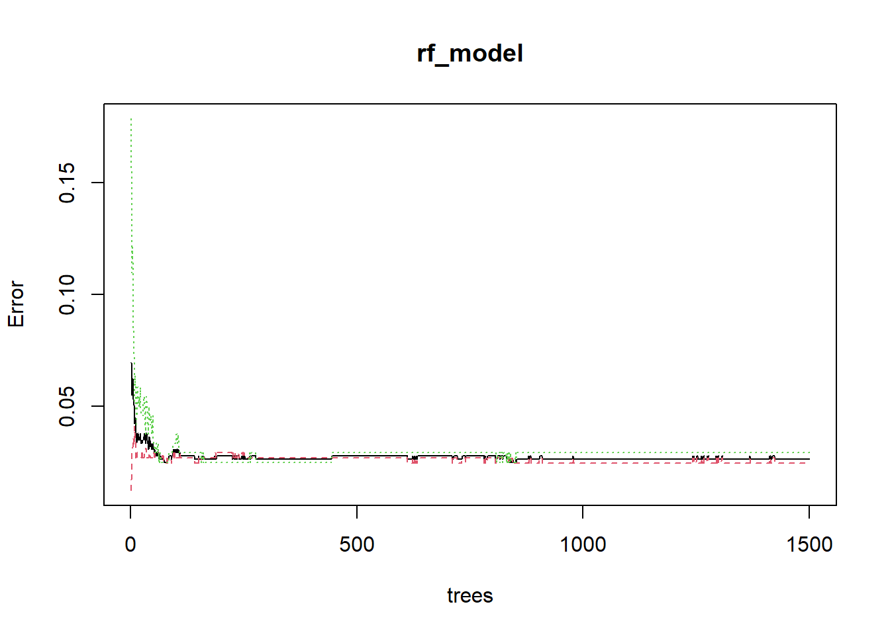
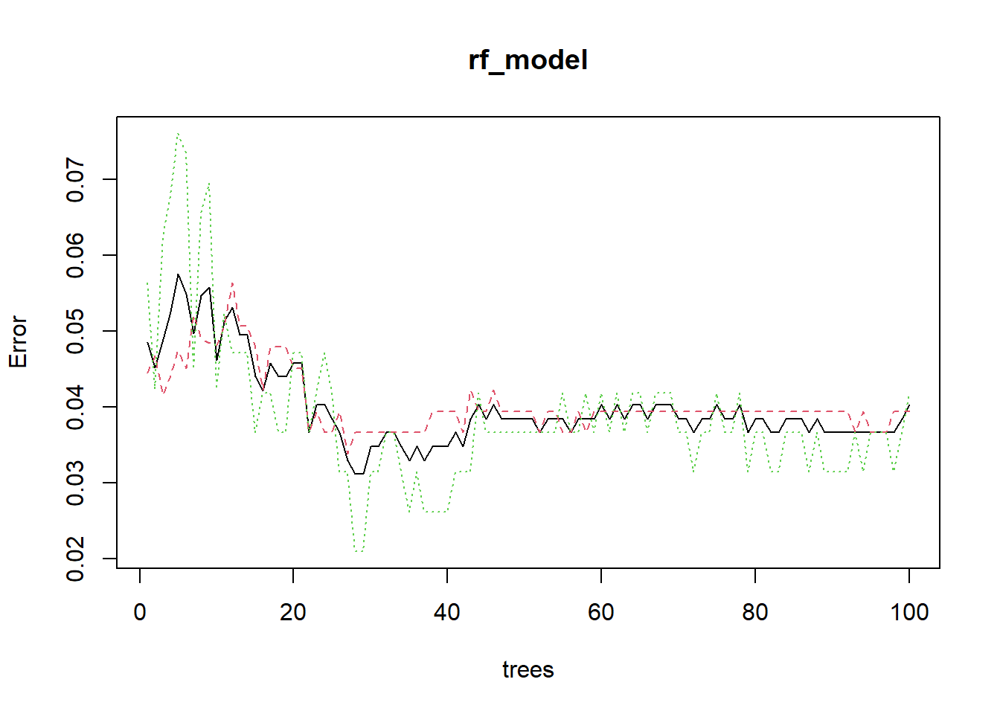

Dữ liệu được lấy từ trang https://archive.ics.uci.edu/ml/machine-learning-databases/breast-cancer-wisconsin/

Citation Request:
   This breast cancer databases was obtained from the University of Wisconsin
   Hospitals, Madison from Dr. William H. Wolberg.  If you publish results
   when using this database, then please include this information in your
   acknowledgements.  Also, please cite one or more of:

   1. O. L. Mangasarian and W. H. Wolberg: "Cancer diagnosis via linear 
      programming", SIAM News, Volume 23, Number 5, September 1990, pp 1 & 18.

   2. William H. Wolberg and O.L. Mangasarian: "Multisurface method of 
      pattern separation for medical diagnosis applied to breast cytology", 
      Proceedings of the National Academy of Sciences, U.S.A., Volume 87, 
      December 1990, pp 9193-9196.

   3. O. L. Mangasarian, R. Setiono, and W.H. Wolberg: "Pattern recognition 
      via linear programming: Theory and application to medical diagnosis", 
      in: "Large-scale numerical optimization", Thomas F. Coleman and Yuying
      Li, editors, SIAM Publications, Philadelphia 1990, pp 22-30.

   4. K. P. Bennett & O. L. Mangasarian: "Robust linear programming 
      discrimination of two linearly inseparable sets", Optimization Methods
      and Software 1, 1992, 23-34 (Gordon & Breach Science Publishers).
      
  Có 699 dòng (đối tượng) và 11 thuộc tính.
  Thiếu 16 giá trị thuộc tính.
  Có 2 loại lành và ác tính. 
  #  Attribute                                                   Domain
   -- ------------------------------------------------------------------
   1. Sample code number(Sample_No)                              id number
   2. Clump Thickness (Clump_Thickness)                          1 - 10
   3. Uniformity of Cell Size(Uniformity_Cell_Size)              1 - 10
   4. Uniformity of Cell Shape(Uniformity_Cell_Shape)            1 - 10
   5. Marginal Adhesion(Marginal_Adhesion)                       1 - 10
   6. Single Epithelial Cell Size(Single_Epithelial_Cell_Size)   1 - 10
   7. Bare Nuclei(Bare_Nuclei)                                   1 - 10
   8. Bland Chromatin(Bland_Chromatin)                           1 - 10
   9. Normal Nucleoli(Normal_Nucleoli)                           1 - 10
  10. Mitoses(Mitoses)                                           1 - 10
  11. Class:(class)                                             (2 for benign, 4 for malignant)


  

```r
library(randomForest)
```

```
## Warning: package 'randomForest' was built under R version 4.0.5
```

```
## randomForest 4.6-14
```

```
## Type rfNews() to see new features/changes/bug fixes.
```

```r
library(caTools)
```

```
## Warning: package 'caTools' was built under R version 4.0.5
```

```r
library(caret)
```

```
## Loading required package: lattice
```

```
## Loading required package: ggplot2
```

```
## 
## Attaching package: 'ggplot2'
```

```
## The following object is masked from 'package:randomForest':
## 
##     margin
```

```r
library(class)
```
**Đọc dữ liệu**

```r
#Ctrl+Shift+H để chọn directory chứa folder data
data_path <- file.path( "/data", "breast-cancer-wisconsin.data")

names <- c('Sample_No', 'Clump_Thickness', 'Uniformity_Cell_Size', 
         'Uniformity_Cell_Shape', 'Marginal_Adhesion', 'Single_Epithelial_Cell_Size', 
         'Bare_Nuclei', 'Bland_Chromatin', 
         'Normal_Nucleoli','Mitoses', 
         'class')

data <- read.table(data_path, sep = ',', col.names = names)
#"D:/University/3_2/datamining/project/DataMining_BreastCancer/BreastCancer/data/breast-cancer-wisconsin.data"
OutCome=ifelse(data$class==2,"No","Yes")

data=data.frame(data,OutCome)

#drop class and sample_no column
data$class<-NULL
data$Sample_No<-NULL

data$OutCome<-as.factor(data$OutCome)
```
**Xem dữ liệu thô**

```r
head(data,5)
```

```
##   Clump_Thickness Uniformity_Cell_Size Uniformity_Cell_Shape Marginal_Adhesion
## 1               5                    1                     1                 1
## 2               5                    4                     4                 5
## 3               3                    1                     1                 1
## 4               6                    8                     8                 1
## 5               4                    1                     1                 3
##   Single_Epithelial_Cell_Size Bare_Nuclei Bland_Chromatin Normal_Nucleoli
## 1                           2           1               3               1
## 2                           7          10               3               2
## 3                           2           2               3               1
## 4                           3           4               3               7
## 5                           2           1               3               1
##   Mitoses OutCome
## 1       1      No
## 2       1      No
## 3       1      No
## 4       1      No
## 5       1      No
```

```r
str(data)
```

```
## 'data.frame':	699 obs. of  10 variables:
##  $ Clump_Thickness            : int  5 5 3 6 4 8 1 2 2 4 ...
##  $ Uniformity_Cell_Size       : int  1 4 1 8 1 10 1 1 1 2 ...
##  $ Uniformity_Cell_Shape      : int  1 4 1 8 1 10 1 2 1 1 ...
##  $ Marginal_Adhesion          : int  1 5 1 1 3 8 1 1 1 1 ...
##  $ Single_Epithelial_Cell_Size: int  2 7 2 3 2 7 2 2 2 2 ...
##  $ Bare_Nuclei                : chr  "1" "10" "2" "4" ...
##  $ Bland_Chromatin            : int  3 3 3 3 3 9 3 3 1 2 ...
##  $ Normal_Nucleoli            : int  1 2 1 7 1 7 1 1 1 1 ...
##  $ Mitoses                    : int  1 1 1 1 1 1 1 1 5 1 ...
##  $ OutCome                    : Factor w/ 2 levels "No","Yes": 1 1 1 1 1 2 1 1 1 1 ...
```

```r
# Chuyển Bảe_Nuclei về dạng numeric

data$Bare_Nuclei=as.integer(data$Bare_Nuclei)
```

```
## Warning: NAs introduced by coercion
```

```r
str(data)
```

```
## 'data.frame':	699 obs. of  10 variables:
##  $ Clump_Thickness            : int  5 5 3 6 4 8 1 2 2 4 ...
##  $ Uniformity_Cell_Size       : int  1 4 1 8 1 10 1 1 1 2 ...
##  $ Uniformity_Cell_Shape      : int  1 4 1 8 1 10 1 2 1 1 ...
##  $ Marginal_Adhesion          : int  1 5 1 1 3 8 1 1 1 1 ...
##  $ Single_Epithelial_Cell_Size: int  2 7 2 3 2 7 2 2 2 2 ...
##  $ Bare_Nuclei                : int  1 10 2 4 1 10 10 1 1 1 ...
##  $ Bland_Chromatin            : int  3 3 3 3 3 9 3 3 1 2 ...
##  $ Normal_Nucleoli            : int  1 2 1 7 1 7 1 1 1 1 ...
##  $ Mitoses                    : int  1 1 1 1 1 1 1 1 5 1 ...
##  $ OutCome                    : Factor w/ 2 levels "No","Yes": 1 1 1 1 1 2 1 1 1 1 ...
```

```r
summary(data)
```

```
##  Clump_Thickness  Uniformity_Cell_Size Uniformity_Cell_Shape Marginal_Adhesion
##  Min.   : 1.000   Min.   : 1.000       Min.   : 1.000        Min.   : 1.000   
##  1st Qu.: 2.000   1st Qu.: 1.000       1st Qu.: 1.000        1st Qu.: 1.000   
##  Median : 4.000   Median : 1.000       Median : 1.000        Median : 1.000   
##  Mean   : 4.418   Mean   : 3.134       Mean   : 3.207        Mean   : 2.807   
##  3rd Qu.: 6.000   3rd Qu.: 5.000       3rd Qu.: 5.000        3rd Qu.: 4.000   
##  Max.   :10.000   Max.   :10.000       Max.   :10.000        Max.   :10.000   
##                                                                               
##  Single_Epithelial_Cell_Size  Bare_Nuclei     Bland_Chromatin  Normal_Nucleoli 
##  Min.   : 1.000              Min.   : 1.000   Min.   : 1.000   Min.   : 1.000  
##  1st Qu.: 2.000              1st Qu.: 1.000   1st Qu.: 2.000   1st Qu.: 1.000  
##  Median : 2.000              Median : 1.000   Median : 3.000   Median : 1.000  
##  Mean   : 3.216              Mean   : 3.545   Mean   : 3.438   Mean   : 2.867  
##  3rd Qu.: 4.000              3rd Qu.: 6.000   3rd Qu.: 5.000   3rd Qu.: 4.000  
##  Max.   :10.000              Max.   :10.000   Max.   :10.000   Max.   :10.000  
##                              NA's   :16                                        
##     Mitoses       OutCome  
##  Min.   : 1.000   No :458  
##  1st Qu.: 1.000   Yes:241  
##  Median : 1.000            
##  Mean   : 1.589            
##  3rd Qu.: 1.000            
##  Max.   :10.000            
## 
```


```r
names(data)
```

```
##  [1] "Clump_Thickness"             "Uniformity_Cell_Size"       
##  [3] "Uniformity_Cell_Shape"       "Marginal_Adhesion"          
##  [5] "Single_Epithelial_Cell_Size" "Bare_Nuclei"                
##  [7] "Bland_Chromatin"             "Normal_Nucleoli"            
##  [9] "Mitoses"                     "OutCome"
```

```r
class(data)
```

```
## [1] "data.frame"
```

```r
sum(is.na(data))
```

```
## [1] 16
```

```r
data=na.omit(data)
```


```r
table(data$OutCome)/nrow(data)
```

```
## 
##        No       Yes 
## 0.6500732 0.3499268
```
Có 65% lành tính( benign) và 37% ác tính trong số các bệnh nhân được chẩn đoán trong tập dataset.


*Building model*


```r
rf_model <- randomForest(OutCome ~ ., data=data, ntree=1500, mtry=3, importance=TRUE)
rf_model
```

```
## 
## Call:
##  randomForest(formula = OutCome ~ ., data = data, ntree = 1500,      mtry = 3, importance = TRUE) 
##                Type of random forest: classification
##                      Number of trees: 1500
## No. of variables tried at each split: 3
## 
##         OOB estimate of  error rate: 2.64%
## Confusion matrix:
##      No Yes class.error
## No  433  11  0.02477477
## Yes   7 232  0.02928870
```
Số cây : 1500
Số biến được thử ở mỗi lần tách : 3
Loại random forest: phân loại
OOB estimate tỉ lệ lỗi : 3 %


```r
plot(rf_model)
```


Biểu đồ lỗi cho biết lỗi với các lớp khác nhau ( màu đỏ và xanh) và out-of-bag so với số lượng cây. Màu đỏ lành tính và mày xanh ác tính. Lỗi thấp nhất đạt được từ 1200, sau đó điều chỉnh cũng không cải thiện hiệu suất.


**chia tập dữ liệu thành tập training và testing**
chia dữ liệu 60% train, 20% validation và 20 % test


```r
set.seed(2)

sample<-sample.split(data$OutCome, SplitRatio=0.80)

data.trainvalidation<- subset(data,sample==TRUE)

data.test<-subset(data,sample==FALSE) #0.2 test


sample_val <- sample.split(data.trainvalidation$OutCome, SplitRatio = 0.75)
data.train <- subset(data.trainvalidation,sample_val==TRUE) # 0.6 train
data.validation <- subset(data.trainvalidation,sample_val==FALSE) #0.2 validation
```
**Model building & Interpretation on Training and Testing Data**

Lựa chọn siêu tham số :
   mtry 
   ntry
   độ phức tạp của cây
   Sơ đồ lấy mẫu
   Luật chia


#Cách 2 #

```r
ntrees <-c(100,200,250,300,400,500,600, 800,850, 1000,1100, 1200,1500)
mtrees <- c(1:9) # mtry lớn nhất 9 vì data có 9 column để dự đoán 
best_rmse <-1
best_accuracy<-0
for (ntree in ntrees)
   for (mtree in mtrees){
      rf_model <- randomForest(OutCome ~ ., data=data.train, ntree=ntree, mtry=mtree, importance=TRUE) #train ở tập train
       pre <- predict(rf_model, data.validation) # đánh giá trên tập validation
       rmse= sqrt(mean(pre != data.validation$OutCome)^2) # hàm đánh giá RMSE
       accuracy=postResample(pre,data.validation$OutCome )[1] # đánh giá accuracy
       
       print(paste(ntree, mtree ,rmse, accuracy))
       
       if(best_rmse>rmse){
          best_ntry=ntree
          best_mtry=mtree
          best_rmse=rmse
       }
        
       if(best_accuracy<accuracy){
          best_ntryac=ntree
          best_mtryac=mtree
          best_accuracy=accuracy
       }
       
      
   }
```

```
## [1] "100 1 0.0072992700729927 0.992700729927007"
## [1] "100 2 0.0072992700729927 0.992700729927007"
## [1] "100 3 0.0072992700729927 0.992700729927007"
## [1] "100 4 0.0145985401459854 0.985401459854015"
## [1] "100 5 0.0072992700729927 0.992700729927007"
## [1] "100 6 0.0145985401459854 0.985401459854015"
## [1] "100 7 0.0145985401459854 0.985401459854015"
## [1] "100 8 0.0145985401459854 0.985401459854015"
## [1] "100 9 0.0218978102189781 0.978102189781022"
## [1] "200 1 0.0072992700729927 0.992700729927007"
## [1] "200 2 0.0145985401459854 0.985401459854015"
## [1] "200 3 0.0072992700729927 0.992700729927007"
## [1] "200 4 0.0072992700729927 0.992700729927007"
## [1] "200 5 0.0145985401459854 0.985401459854015"
## [1] "200 6 0.0072992700729927 0.992700729927007"
## [1] "200 7 0.0145985401459854 0.985401459854015"
## [1] "200 8 0.0145985401459854 0.985401459854015"
## [1] "200 9 0.0218978102189781 0.978102189781022"
## [1] "250 1 0.0072992700729927 0.992700729927007"
## [1] "250 2 0.0072992700729927 0.992700729927007"
## [1] "250 3 0.0072992700729927 0.992700729927007"
## [1] "250 4 0.0072992700729927 0.992700729927007"
## [1] "250 5 0.0145985401459854 0.985401459854015"
## [1] "250 6 0.0145985401459854 0.985401459854015"
## [1] "250 7 0.0145985401459854 0.985401459854015"
## [1] "250 8 0.0145985401459854 0.985401459854015"
## [1] "250 9 0.0145985401459854 0.985401459854015"
## [1] "300 1 0.0072992700729927 0.992700729927007"
## [1] "300 2 0.0072992700729927 0.992700729927007"
## [1] "300 3 0.0072992700729927 0.992700729927007"
## [1] "300 4 0.0145985401459854 0.985401459854015"
## [1] "300 5 0.0145985401459854 0.985401459854015"
## [1] "300 6 0.0145985401459854 0.985401459854015"
## [1] "300 7 0.0145985401459854 0.985401459854015"
## [1] "300 8 0.0145985401459854 0.985401459854015"
## [1] "300 9 0.0145985401459854 0.985401459854015"
## [1] "400 1 0.0072992700729927 0.992700729927007"
## [1] "400 2 0.0072992700729927 0.992700729927007"
## [1] "400 3 0.0072992700729927 0.992700729927007"
## [1] "400 4 0.0072992700729927 0.992700729927007"
## [1] "400 5 0.0072992700729927 0.992700729927007"
## [1] "400 6 0.0145985401459854 0.985401459854015"
## [1] "400 7 0.0145985401459854 0.985401459854015"
## [1] "400 8 0.0145985401459854 0.985401459854015"
## [1] "400 9 0.0145985401459854 0.985401459854015"
## [1] "500 1 0.0072992700729927 0.992700729927007"
## [1] "500 2 0.0072992700729927 0.992700729927007"
## [1] "500 3 0.0072992700729927 0.992700729927007"
## [1] "500 4 0.0145985401459854 0.985401459854015"
## [1] "500 5 0.0072992700729927 0.992700729927007"
## [1] "500 6 0.0145985401459854 0.985401459854015"
## [1] "500 7 0.0145985401459854 0.985401459854015"
## [1] "500 8 0.0145985401459854 0.985401459854015"
## [1] "500 9 0.0145985401459854 0.985401459854015"
## [1] "600 1 0.0072992700729927 0.992700729927007"
## [1] "600 2 0.0072992700729927 0.992700729927007"
## [1] "600 3 0.0072992700729927 0.992700729927007"
## [1] "600 4 0.0072992700729927 0.992700729927007"
## [1] "600 5 0.0072992700729927 0.992700729927007"
## [1] "600 6 0.0145985401459854 0.985401459854015"
## [1] "600 7 0.0145985401459854 0.985401459854015"
## [1] "600 8 0.0145985401459854 0.985401459854015"
## [1] "600 9 0.0145985401459854 0.985401459854015"
## [1] "800 1 0.0072992700729927 0.992700729927007"
## [1] "800 2 0.0072992700729927 0.992700729927007"
## [1] "800 3 0.0072992700729927 0.992700729927007"
## [1] "800 4 0.0072992700729927 0.992700729927007"
## [1] "800 5 0.0072992700729927 0.992700729927007"
## [1] "800 6 0.0145985401459854 0.985401459854015"
## [1] "800 7 0.0145985401459854 0.985401459854015"
## [1] "800 8 0.0145985401459854 0.985401459854015"
## [1] "800 9 0.0145985401459854 0.985401459854015"
## [1] "850 1 0.0072992700729927 0.992700729927007"
## [1] "850 2 0.0072992700729927 0.992700729927007"
## [1] "850 3 0.0072992700729927 0.992700729927007"
## [1] "850 4 0.0072992700729927 0.992700729927007"
## [1] "850 5 0.0145985401459854 0.985401459854015"
## [1] "850 6 0.0145985401459854 0.985401459854015"
## [1] "850 7 0.0145985401459854 0.985401459854015"
## [1] "850 8 0.0145985401459854 0.985401459854015"
## [1] "850 9 0.0145985401459854 0.985401459854015"
## [1] "1000 1 0.0072992700729927 0.992700729927007"
## [1] "1000 2 0.0072992700729927 0.992700729927007"
## [1] "1000 3 0.0072992700729927 0.992700729927007"
## [1] "1000 4 0.0072992700729927 0.992700729927007"
## [1] "1000 5 0.0145985401459854 0.985401459854015"
## [1] "1000 6 0.0145985401459854 0.985401459854015"
## [1] "1000 7 0.0145985401459854 0.985401459854015"
## [1] "1000 8 0.0145985401459854 0.985401459854015"
## [1] "1000 9 0.0145985401459854 0.985401459854015"
## [1] "1100 1 0.0072992700729927 0.992700729927007"
## [1] "1100 2 0.0072992700729927 0.992700729927007"
## [1] "1100 3 0.0072992700729927 0.992700729927007"
## [1] "1100 4 0.0072992700729927 0.992700729927007"
## [1] "1100 5 0.0072992700729927 0.992700729927007"
## [1] "1100 6 0.0145985401459854 0.985401459854015"
## [1] "1100 7 0.0145985401459854 0.985401459854015"
## [1] "1100 8 0.0145985401459854 0.985401459854015"
## [1] "1100 9 0.0145985401459854 0.985401459854015"
## [1] "1200 1 0.0072992700729927 0.992700729927007"
## [1] "1200 2 0.0072992700729927 0.992700729927007"
## [1] "1200 3 0.0072992700729927 0.992700729927007"
## [1] "1200 4 0.0072992700729927 0.992700729927007"
## [1] "1200 5 0.0145985401459854 0.985401459854015"
## [1] "1200 6 0.0145985401459854 0.985401459854015"
## [1] "1200 7 0.0145985401459854 0.985401459854015"
## [1] "1200 8 0.0145985401459854 0.985401459854015"
## [1] "1200 9 0.0145985401459854 0.985401459854015"
## [1] "1500 1 0.0072992700729927 0.992700729927007"
## [1] "1500 2 0.0072992700729927 0.992700729927007"
## [1] "1500 3 0.0072992700729927 0.992700729927007"
## [1] "1500 4 0.0072992700729927 0.992700729927007"
## [1] "1500 5 0.0072992700729927 0.992700729927007"
## [1] "1500 6 0.0145985401459854 0.985401459854015"
## [1] "1500 7 0.0145985401459854 0.985401459854015"
## [1] "1500 8 0.0145985401459854 0.985401459854015"
## [1] "1500 9 0.0145985401459854 0.985401459854015"
```

```r
print(paste(best_ntry, best_mtry ,best_rmse))
```

```
## [1] "100 1 0.0072992700729927"
```

```r
print(paste(best_ntryac, best_mtryac ,best_accuracy))
```

```
## [1] "100 1 0.992700729927007"
```


```r
 rf_model <- randomForest(OutCome ~ ., data=data.trainvalidation, ntree=best_ntry, mtry=best_mtry, importance=TRUE)


summary(rf_model)
```

```
##                 Length Class  Mode     
## call               6   -none- call     
## type               1   -none- character
## predicted        546   factor numeric  
## err.rate         300   -none- numeric  
## confusion          6   -none- numeric  
## votes           1092   matrix numeric  
## oob.times        546   -none- numeric  
## classes            2   -none- character
## importance        36   -none- numeric  
## importanceSD      27   -none- numeric  
## localImportance    0   -none- NULL     
## proximity          0   -none- NULL     
## ntree              1   -none- numeric  
## mtry               1   -none- numeric  
## forest            14   -none- list     
## y                546   factor numeric  
## test               0   -none- NULL     
## inbag              0   -none- NULL     
## terms              3   terms  call
```

```r
print(rf_model)
```

```
## 
## Call:
##  randomForest(formula = OutCome ~ ., data = data.trainvalidation,      ntree = best_ntry, mtry = best_mtry, importance = TRUE) 
##                Type of random forest: classification
##                      Number of trees: 100
## No. of variables tried at each split: 1
## 
##         OOB estimate of  error rate: 4.03%
## Confusion matrix:
##      No Yes class.error
## No  341  14  0.03943662
## Yes   8 183  0.04188482
```


```r
plot(rf_model)
```




```r
ran_pred <- predict(rf_model, data.test)

table(data.test$OutCome, ran_pred)
```

```
##      ran_pred
##       No Yes
##   No  89   0
##   Yes  0  48
```

```r
ran_prob <- predict(rf_model,data.test)
ran_prob
```

```
##   5   7   9  15  23  25  32  39  40  43  44  47  48  70  74  76  80  84  86  88 
##  No  No  No Yes  No  No  No Yes Yes Yes Yes Yes  No  No Yes  No  No  No Yes Yes 
##  90  97 104 108 111 114 119 122 142 157 158 166 175 180 184 190 193 196 206 208 
##  No  No Yes Yes  No Yes  No  No  No  No  No  No Yes Yes Yes  No  No  No Yes  No 
## 210 211 212 217 224 226 227 229 230 240 246 251 254 259 263 264 269 280 284 286 
##  No Yes Yes  No Yes  No Yes  No Yes Yes  No  No Yes  No Yes Yes Yes Yes Yes Yes 
## 290 294 299 308 314 315 324 328 336 342 352 355 364 373 381 385 388 394 396 398 
## Yes Yes  No  No  No  No Yes  No  No  No  No  No  No  No  No  No  No  No  No  No 
## 406 410 411 413 417 418 421 424 428 432 438 439 471 473 474 475 479 483 487 496 
##  No  No  No Yes Yes  No  No  No Yes  No  No  No  No  No  No  No  No Yes  No  No 
## 512 516 517 520 524 525 551 552 558 559 560 561 568 572 579 582 587 593 605 607 
##  No Yes  No Yes Yes  No  No  No  No  No  No  No  No Yes  No Yes Yes Yes Yes  No 
## 613 619 631 635 642 650 651 667 670 671 674 681 683 684 687 689 690 
## Yes  No  No  No  No  No  No  No Yes Yes  No Yes  No  No  No  No  No 
## Levels: No Yes
```

```r
#ran_prob1<-data.frame(ran_prob)
rmse= sqrt(mean(ran_prob != data.test$OutCome)^2)
print(rmse)
```

```
## [1] 0
```

```r
accuracy=postResample(ran_prob,data.test$OutCome )[1]
print(accuracy)
```

```
## Accuracy 
##        1
```


# KNN

```r
classifier_knn <- knn(train = data.train[,1:9], 
                      test = data.validation[,1:9], 
                      cl= data.train$OutCome ,
                      k=5 )
classifier_knn
```

```
##   [1] No  No  No  No  Yes Yes Yes Yes No  No  Yes Yes No  No  No  No  No  No 
##  [19] Yes Yes No  Yes Yes No  No  No  Yes No  No  Yes No  No  No  Yes No  No 
##  [37] Yes No  Yes Yes Yes No  No  No  Yes No  No  Yes No  Yes Yes Yes Yes No 
##  [55] No  No  Yes Yes Yes Yes No  Yes No  Yes Yes No  Yes No  Yes Yes No  Yes
##  [73] No  No  No  No  No  No  No  No  No  No  No  No  Yes No  No  No  No  Yes
##  [91] No  Yes Yes No  No  No  No  No  No  No  No  No  No  No  No  No  No  No 
## [109] No  No  Yes No  No  No  Yes Yes No  No  Yes Yes Yes No  No  No  No  No 
## [127] Yes No  No  No  No  No  Yes No  No  No  No 
## Levels: No Yes
```

```r
misClassError <- mean(classifier_knn != data.validation$OutCome)
print(paste('Accuracy =', 1-misClassError))
```

```
## [1] "Accuracy = 0.985401459854015"
```


```r
library(class)
trainKNN= data.train

validKNN= data.validation
klist<- c(1:10)
best_accuracyKNN <- 0
best_k<-0
for(k in klist){
   classifier_knn <- knn(train = data.train[,1:9], 
                      test = data.validation[,1:9], 
                      cl= data.train$OutCome ,
                      k=k )
   misClassError <- mean(classifier_knn != data.validation$OutCome)
   if(1-misClassError>best_accuracyKNN){
      best_accuracyKNN=1-misClassError
      best_k=k
   }
 
}
print(paste('Accuracy =', best_accuracyKNN, 'k=',best_k))
```

```
## [1] "Accuracy = 0.992700729927007 k= 3"
```

```r
# train và test lại
classifier_knn <- knn(train = data.trainvalidation[,1:9], 
                      test = data.test[,1:9], 
                      cl= data.trainvalidation$OutCome ,
                      k=best_k )
classifier_knn
```

```
##   [1] No  No  No  Yes No  No  No  Yes Yes Yes Yes Yes No  No  Yes No  No  No 
##  [19] Yes Yes No  No  Yes Yes No  Yes No  No  No  No  No  No  Yes Yes Yes No 
##  [37] No  No  Yes No  No  Yes Yes No  Yes No  Yes No  Yes Yes No  No  Yes No 
##  [55] Yes Yes Yes Yes Yes Yes Yes Yes No  No  No  No  Yes No  No  No  No  No 
##  [73] No  No  No  No  No  No  No  No  No  No  No  Yes Yes No  No  No  Yes No 
##  [91] No  No  No  No  No  No  No  Yes No  No  No  Yes No  Yes Yes No  No  No 
## [109] No  No  No  No  No  Yes No  Yes Yes Yes Yes No  Yes No  No  No  No  No 
## [127] No  No  Yes Yes No  Yes No  No  No  No  No 
## Levels: No Yes
```

```r
misClassError <- mean(classifier_knn != data.test$OutCome)
print(paste('Accuracy =', 1-misClassError))
```

```
## [1] "Accuracy = 1"
```
