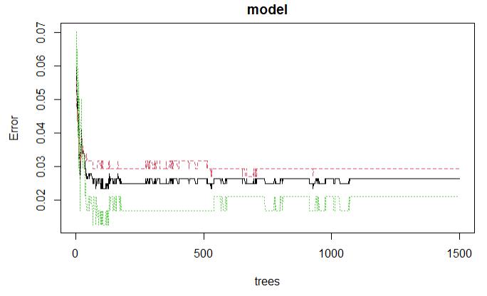
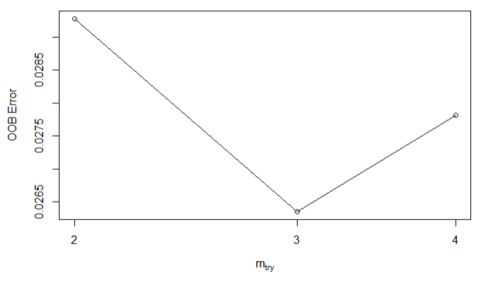

```{r setup, include=FALSE}
knitr::opts_chunk$set(echo = TRUE)
```

## Đề tài: Predicting Probability of Malignant and Benign Breast Cancer 

<Span>**Giáo viên hướng dẫn**" Quách Đình Hoàng </Span>

<span>**Thành viên**:</span>

<span>18110281    Đoàn Mạnh Hiếu</span>

<span>18110352    Đặng Văn Sang</span>

<span>18110288    Trần Ngọc Hoàng</span>

<span>18110283    Nguyễn Ngọc Trung Hiếu</span>
```{r cars}
```

## 1. Tóm tắt
  

```{r pressure, echo=FALSE}
plot(pressure)

```


# 1. Tóm tắt

```{r pressure, echo=FALSE}

```

# 2. Giới thiệu
  Bài toán nhóm muốn giải quyết ở đây là dựa vào dữ liệu Breast Cancer (ung thư vú) đã thu thập được, nhóm sẽ phân tích các đặc điểm và kết quả để có thể từ đó, dựa vào các đặc điểm đã biết có thể dự đoán được các kết quả chưa biết trong tương lai.
  
  Tầm quan trọng: Ung thư vú là loại ung thư đứng thứ hai xảy ra ở phụ nữ so với các loại ung thư khác. Do đó, việc dự đoán kết quả ung thư vú rất quan trọng. Bởi vì việc này vừa giúp tiết kiệm thời gian xử lý, chi phí khám bệnh, vừa có thể dự trù ngay kết quả. Từ đó, bác sĩ có thể đưa ra quy trình xử lý, thứ tự ưu tiên phù hợp đối với kết quả chuẩn đoán ung thư vú tới từng bệnh nhân.
  
  Để thực hiện việc dự đoán những kết quả chưa biết, nhóm sử dụng thuật toán Random Forest và K-nearest neighbors để giải quyết bài toán này
  
  Input và output của bài toán: Input là các đặc điểm của bệnh ung thư vú. Từ đó, dựa trên các đặc điểm để cho Output là những đặc điểm đó có là ung thư vú hay không.
  
  Vì nhóm sử dụng thuật toán Random Forest và thuật toán K-nearest neighbors để dự đoán kết quả ung thư vú, nên đầu vào của hai bài toán này sẽ là các đặc điểm của ung thư vú. Random Forest sẽ tiến hành xử dụng Decision Tree để dự đoán bệnh ung thư vú trên dữ liệu mới, còn K-nearest neighbors sẽ tính toán dự đoán kết quả trên dữ liệu mới.
  
# 3. Dữ liệu
## 3.1. Mô tả dữ liệu
  Dữ liệu Breast Cancer là tập các record thể hiện khối u lành tính và khối u ác tính từ các giá trị của tế bào. Bao gồm các đặc điểm sau: Clump Thickness, Uniformity Cell Size, Uniformity Cell Shape, Marginal Adhesion, Single Epithelial Cell Size, Bare Nuclei, Bland Chromatin, Normal Nucleoli, Mitoses, Class
  
  Dữ liệu có tổng cộng 699 mẫu. Trong đó, 16 mẫu lỗi, 683 mẫu không lỗi. Dựa trên kết quả dự đoán ung thư trên tập dataset này, ta có 34.5% record cho kết quả là khối u ác tính, 65.5% record cho kết quả là khối u lành tính.
  
  Dữ liệu có 11 biến. Trong đó, 1 biến kiểu nominal, 9 kiểu numberic và 1 kiểu binary attributes.
  
## 3.2. Phân chia dữ liệu
  Đối với thuật toán Random Forest, nhóm chia dữ liệu thành 2 phần, 70% cho tập training và 30% cho tập testing.
  
  Đối với các thuật toán còn lại, nhóm chia dữ liệu thành 3 phần, 60% cho tập training, 20% cho tập validation và 20% cho tập testing.
  
  Nhóm sẽ tiến hành loại bỏ cột đầu tiên trong tập dữ liệu Breast Cancer bởi vì nó không có ý nghĩa trong quá trình giải quyết bài toán.
  
# 4. Giải pháp
## 4.1. Thuật toán Random Forest
### Các công thức
 Công thức tính toán Node Importance trong Scikit-learn:
 $$ni_j = w_jC_j - W_{left(j)}C_{left(j)} - W_{right(j)}C_{right(j)}$$
 Trong đó: 
 
 ni sub(j): importance của node j
 
 w sub(j): trọng số của mẫu đến node j
 
 C sub(j): giá trị impurity của node j
 
 left(j): những node con chia về bên trái của node j
 
 right(j): những node con chia về bên phải của node j
 
 Công thức tính toán Importance của mỗi đặc điểm trên Decision Tree của Random Forest:
 
 $$fi_i = \frac{\sum{_{j:node\ j\ splits\ on\ feature\ j}}ni_j} {\sum{_{k\in all\ nodes}ni_k}}$$
 Trong đó:
 
 fi sub(i): importance của đặc điểm i
 
 ni sub(j): importance của node j
 
 Công thức chuẩn hóa giá:
 $$normfi_i = \frac{fi_i}{\sum{_{j\in all\ features}fi_j}}$$
  Công thức tính toán importance cho các đặc điểm cuối cùng của tất cả các desicion tree:
  $$RFfi_i = \frac{\sum {_{j\in all\ trees}normfi_{ij}}} {T}$$
  Trong đó:
  RFfi sub(i): importance của đặc điểm được tính toán từ tất cả các tree trong Random Forest
  normfi sub(ij): đặc điểm importance được chuẩn hóa của i trong cây j
  T: tổng số tree

### Cách hoạt động

    Random Forest bắt đầu bằng Decision Tree. Trong từng Decision Tree, một input sẽ đựa đưa vào top của Decision Tree đó, theo Decision Tree để dữ liệu được chia thành những tập nhỏ hơn. Random Forest trong code sẽ nhận hai tham số là ntree (số cây cần thực hiện) và mtry (số lượng biến được lấy mẫu ngẫu nhiên) để thực hiện bài toán trên dữ liệu. Mỗi Decision Tree cho ra một kết quả. Như vậy, với hàng trăm, hàng ngàn Decision Tree, ta sẽ có hàng trăm, hàng ngàn kết quả. Random Forest tiến hành chọn lọc kết quả bằng việc vote từ kết quả của toàn bộ Decision Tree.
    
# 5. Thực nghiệm và kết quả
## 5.1. Thuật toán Random Forest
### Cách chọn siêu tham số
Bước 1: Tìm siêu tham số cho ntree

Xây dựng một model Random Forest với ntree là 1500 và mtry là 3. Từ model, ta sẽ biểu diễn một biểu đồ tree và sự biến thiên sai số OOB để tìm vị trí OOB ổn định.
  
```{r}
library(knitr)


```
 
 Hình ảnh trên là kết quả của việc xây dựng Random Model trên tập dữ liệu Breast Cancer với ntree là 1500 và mtry là 3. Trục x là thứ tự cây và trục y là biến thiên sai số OOB. Nhìn vào nhìn biểu đồ, ta thấy từ cây thứ 1100 trở đi, OOB biến động rất ít và ổn định. Như vậy ta đã tìm được siêu tham số cho ntree là 1100.

Bước 2: Tìm siêu tham số cho mtry

Sau khi tìm được siêu tham số cho ntree, ta dựa vào ntree đó để tìm siêu tham số cho mtry. Ta vẽ biểu đồ thể hiện biến thiên sai số OOB với từng mtry tương ứng.

```{r}


```

Như trong biểu đồ, ta thấy mtry bằng 3 cho sai số OOB nhỏ nhất. Vì vậy ta sẽ chọn mtry bằng 3. Như vậy ta đã tìm được hai siêu tham số cho ntree là 1100 và mtry là 3 để giải quyết bài toán đặt ra bằng thuật toán Random Forest.

### Đánh giá kết quả của thuật toán Random Forest
Để đánh giá kết quả của thuật toán Random Forest, nhóm sử dụng confusion matrix để tìm giá trị Balanced Accuracy (giúp đánh giá mức độ tốt của việc classifier) và FScore (đánh giá độ chính xác của mô hình trên tập dữ liệu:

Kết quả dự đoán trên tập train của Random Forest cho giá trị Balanced Accuraty là 97.59% và Fscore = 97.95%. Điều này có nghĩa là model Random Forest được xây dụng trên hai siêu tham số ntree và mtry tìm được đạt độ chính xác cao, mang lại hiệu quả tốt.

Kết quả dự đoán trên tập test cho giá trị Balanced Accuracy và Fscore đều đạt giá trị 100%. Như vậy, với model Random Forest được nhóm em xây dựng, việc dự đoán những kết quả chưa biết mang độ chính xác 100%


# 6. Kết luận
# 7. Tài liệu tham khảo
  
