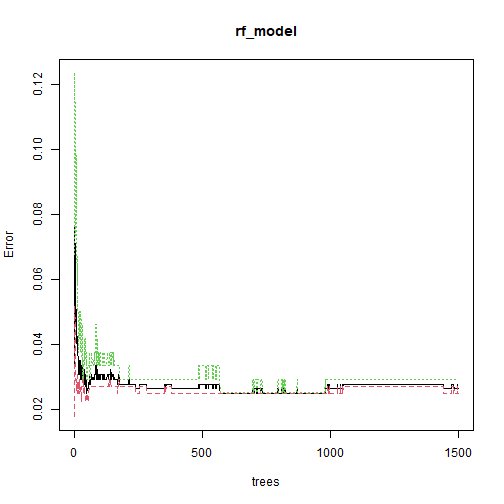

Breast Cancer
========================================================
author: 
date: 
autosize: true


Breast Cancer
========================================================
Ung thư vú là loại ung thư đứng hàng thứ hai xảy ra ở phụ nữ so với tất cả các loại ung thư khác.

- Khối u lành tính
- Khối u ác tính


Mô tả về tập dữ liệu
========================================================
**Breast Cancer Wisconsin Data set có sẵn trong UCI Machine Learning Repository**

Được thu thập từ University of Wisconsin Hospitals Dataset có tổng cộng **699 pattern** gồm 16 pattern lỗi, 683 pattern không lỗi, gồm **11 biến**: 1 biến kiểu nominal, 9 biến là kiểu numberic và 1 biến kiểu binary attributes.

Thông tin các thuộc tính
========================================================

-	Sample code number: id của dataset
- Clump thickness : độ dày cụm tế bào lành tính
- Uniformity of Cell Size : tính đồng nhất về kích thước của tế bào
- Uniformity of Cell Shape: tính đồng nhất về hình dạng của tế bào

Thông tin các thuộc tính
=================================================
-	Marginal Adhesion: các tế bào bính thường có xu hướng kết dính lại với nhau
-	Single Epithelial Cell Size
-	Bare Nuclei
-	Bland Chromatin
-	Normal Nucleoli
-	Mitoses
-	Class


=====================================

```
'data.frame':	699 obs. of  10 variables:
 $ Clump_Thickness            : int  5 5 3 6 4 8 1 2 2 4 ...
 $ Uniformity_Cell_Size       : int  1 4 1 8 1 10 1 1 1 2 ...
 $ Uniformity_Cell_Shape      : int  1 4 1 8 1 10 1 2 1 1 ...
 $ Marginal_Adhesion          : int  1 5 1 1 3 8 1 1 1 1 ...
 $ Single_Epithelial_Cell_Size: int  2 7 2 3 2 7 2 2 2 2 ...
 $ Bare_Nuclei                : int  1 10 2 4 1 10 10 1 1 1 ...
 $ Bland_Chromatin            : int  3 3 3 3 3 9 3 3 1 2 ...
 $ Normal_Nucleoli            : int  1 2 1 7 1 7 1 1 1 1 ...
 $ Mitoses                    : int  1 1 1 1 1 1 1 1 5 1 ...
 $ OutCome                    : Factor w/ 2 levels "No","Yes": 1 1 1 1 1 2 1 1 1 1 ...
```
Dataset
=============================================
458 mẫu lành tính chiếm 65.5%

241 mẫu ác tính chiếm 34.5%

```

       No       Yes 
0.6552217 0.3447783 
```
Độ đo để đánh giá kết quả
==========================
RMSE

Accuracy


Thuật toán và phương pháp đánh giá
==================================
Random forest

KNN

K-fold cross validation

Decision tree 

Random Forest
===================================

```

Call:
 randomForest(formula = OutCome ~ ., data = data, ntree = 1500,      mtry = 3, importance = TRUE) 
               Type of random forest: classification
                     Number of trees: 1500
No. of variables tried at each split: 3

        OOB estimate of  error rate: 2.64%
Confusion matrix:
     No Yes class.error
No  433  11  0.02477477
Yes   7 232  0.02928870
```

=======================


KNN
==============================


Chia tập dữ liệu 
==================================

Train : 60%

Validation: 20%

Test : 20%

=============================

```r
dim(data.train)
```

```
[1] 409  10
```

```r
dim(data.validation)
```

```
[1] 137  10
```

```r
dim(data.test)
```

```
[1] 137  10
```


Model
=========================

```r
classifier_knn <- knn(train = data.trainvalidation[,1:9], 
                      test = data.test[,1:9], 
                      cl= data.trainvalidation$OutCome ,
                      k=3 )
misClassError <- mean(classifier_knn != data.test$OutCome)
print(paste('Accuracy =', 1-misClassError))
```

```
[1] "Accuracy = 1"
```


